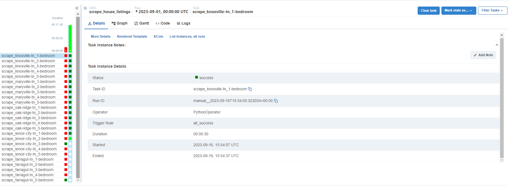

# Homelab Apache Airflow Configuration (w/Firefox Driver for Scraping)



## Setup

### Initialize the Airflow Database

Before starting the Airflow services, it's necessary to initialize its database. You can do this by running the following command:

```bash
$ docker-compose up -f docker-compose.dev.yaml up airflow-init
```

This command specifically targets the airflow-init service within the docker-compose.dev.yaml file, which is responsible for initializing the database.

### Start Airflow Services

Once the database is initialized, you can proceed to start all the services, including the webserver, scheduler, and any other services defined in your docker-compose.dev.yaml file:

```bash
$ docker-compose up -f docker-compose.dev.yaml up
```

After executing this command, your Airflow services should be up and running. You can then access the Airflow web interface via your browser.

**Note**: the docker-compose.prod.yaml is the same but the configuration works with a already existing Postgresql DB running in a docker container, all you have to do is update the default docker network and connection strings with your own

## Custom Configuration

The Dockerfile is built upon the official Apache Airflow image version 2.7.1. It customizes the base image by adding the following:

1. Firefox Installation:

- The Dockerfile-driver creates a image for creating a container w/ Firefox and the Geckodriver
- This allows the Airflow DAGs to use this container as a brower for web scraping with Selenium

  **Note**: The Dockerfile is grabing the aarch-64 version of the driver which works with arm64v8 architecture so if you are using a different architecture update the Dockerfile

  ```
  $GECKODRIVER_VERSION-linux-aarch64.tar.gz
  ```

  ### Benefits over Selenium Grid

  Selenium Grid can't properly render map elements making some web scraping not possible with it but this configureation will allow you to interact with those elements

2. Additional Python Dependencies:

- The Dockerfile assumes that there's a requirements.txt file in the same directory as the Dockerfile.
- This requirements.txt file contains a list of additional Python packages that are required for the Airflow instance.
- The Dockerfile copies this file into the container and installs the Python packages listed in it using pip.
- This customized image is ideal for Airflow workflows that require the use of a browser (e.g., for web scraping tasks) and have specific Python package dependencies.

# DAGS

## House Listing Scraper DAG

This project consists of Python scripts that scrape and collect data about house listings, including their prices, from a website.

### Features

- SQLAlchemy models for house listings and their price histories.
- Utility functions to extract and format house listing data.
- Web scraping capability for collecting real-time data from a housing website.
- Data insertion into a database.

### Dependencies

- SQLAlchemy: For ORM-based database interactions.
- ChromeDriver: For controlling the Chrome web browser.
- Selenium: For automating the web browser.

### Database Structure

1. **HouseListing**:

   - Address (Composite Primary Key)
   - City (Composite Primary Key)
   - State (Composite Primary Key)
   - Zip (Composite Primary Key)
   - Beds
   - Baths
   - Sqft

2. **PriceListing**:
   - Transaction ID (Primary Key)
   - Address (Composite Foriegn Key)
   - City (Composite Foriegn Key)
   - State (Composite Foriegn Key)
   - Zip (Composite Foriegn Key)
   - Price
   - Date
